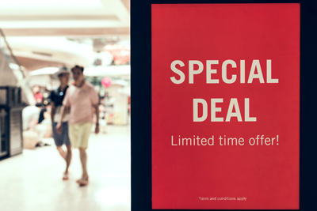
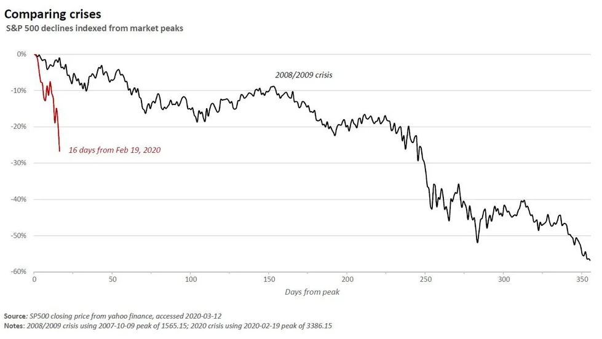

## Koroona kui lõpueksam õpitule
_Avaldatud 14.03.2020_

 

### Koroona eraldab terad sõkaldest, ehk miks see kriis mulle *meeldib* 

Tõusuperioodil on lihtne teenida raha. Viimase 12 aasta jooksul oleks võinud osta praktiliselt mistahes aktsiat, mis 
kuulus kasumlikule firmale ja sa oleks suure tõenäosusega praeguseks plussiks. Investeerimine tõusuperioodil on 
peaaegu täiesti ajudeta tegevus, sest praktiliselt kõigil läheb hästi.

Ma usun, et see investor, kes suudab praegu hoida oma positsioone ja ei jooksnud või ei kavatse joosta müüma, on läbi elamas
sellist *once in a lifetime* võimalust tõestada, et ta suudab ka praktiliselt, läbi languse, mitte ainult teoreetilistes 
lubadustes tõusuperioodil, oma strateegiat hoida ja seetõttu kõlbab pikaajaliseks *väärtusinvestoriks*. See on nagu eksam - 
paneme sind nüüd proovile, et kas bluffisid ja lased kohe püksi kui üks korralik pauk ära käib ja ilmub must luik?

Teisest küljest, need, kes selle kriisi läbi elavad, võivad tulevikus ilmselt rahulikult investeerida, teades, et praktiliselt
miski neid enam ei kõiguta, kui just tuumasõda ei hakka. Praegune langus on olnud kordades järsem kui **2008.** aasta 
finantskriisi ajal, vaid poole kuuga on pühitud minema lugematu hulk raha.

Selle visualiseerimiseks kasutan [/r/wallstreetbets](https://old.reddit.com/r/wallstreetbets/comments/fhxej9/how_this_market_downturn_compares_to_2008_market/) 
kasutaja *swaggymedia* loodud graafikut:

 

Need kes sellest langusest "eluga" välja tulevad on **tõeliselt** väärtusliku kogemuse võrra rikkamad.

Mulle ei tule ühestki raamatust loetu kohta meelde olukord, mis kirjeldaks seda, et kuidas käituda, kui su omatud firma 
muidu kasumlik tegevus jõuga lõpetatakse, näiteks riigi valitsus kehtestab eriolukorra, et nüüd on kinos või teatris käia 
keelatud kuni öeldakse teistmoodi ja sisuliselt kogu firma käive läheneb sel perioodil nullini. See on täiesti erinev finantskriisi 
taolisest olukorrast, kus käive katkeb klientide vaesumise, kokkuhoiupoliitika jms probleemide tõttu, mis pole üldse nii 
järsk langus.

Mul hetkel ei ole enda teada ühtegi sellises firmas osalust, mis tegeleks puhtalt meelelahutusega või mis 100% sõltuks klientide
kohaletulekust või nende liikumisevabadusest, aga kui oleks siis ma ei heidaks siiski meelt ja ei müüks. 

Tuleb meelde tuletada paar olulist punkti, millega tuleb arvestada aktsiatesse investeerides.   

1) Investeerida tohib ainult seda raha, mida oled valmis kaotama. 
2) Investeerida tohib ainult seda raha, mida sul lähiperspektiivis (ca 10a) pole vaja kasutada.
3) Aktsiaturg on tsükliline ja ükskord tuleb langus niikuinii.
4) Iga järgnev kriis on eelmistest natuke erinev ja ükski raamatutarkus ei ütle täpselt mida teha järgmise kriisi ajal.

Seega tuleb hoiduda paanitsemisest ja mõelda oma investeerimispõhimõtete peale. Raha saab alati juurde teenida ja tegelikult
ei tähenda see langev hetkehind mitte midagi - sul on endiselt täpselt samasuur osalus firmas, sama palju aktsiaid kui enne.
Turu viimane tehinguhind ei ole kaugeltki ratsionaalne, vaid kõige suurem *bullshit*, mis vaid kajastab kauplejate meeleolu.

### Kuidas motiveerida ennast mitte müüma?

**Esimesel juhul**, kui see haigus on ülemaailmne katastroof, mis räsib inimkonda veel pikalt, siis ei ole eriti oluline palju sa raha kaotad.
Raha väärtus on teisejärguline, hinda lähevad hoopis muud, reaalsed varad, raha väärtus hakkab kiiresti kahanema. Kõik paberil
olevad ja digitaalsed väärtused vähenevad.
 
**Teisel juhul**, Kui see haigus on mööduv nähtus ja kõik normaliseerub mõne ajapärast, siis tähendab see, et müümine on kahjumlik tegevus.

Esimesel juhul kaotad sa siis kui müüd või ei müü, vahet pole. Teisel juhul kaotad sa siis kui müüd ja ei osta õigel hetkel tagasi.

Kui sa siiski üritad müüa ja hiljem odavamalt tagasi osta, siis langeb see natuke juba spekuleerimise maailma. Üritad turgu ajastada
ja kaubelda. Sellega on kindlasti võimalik kasumisse jääda, aga mina pikaajalise dividendiinvestorina ei ürita turgu ajastada,
ega paanika ajal müüa, kuna teooria ütleb, et see tegevus on riskantne ja need, kes pikaajaliselt hoiavad jäävad palju suurema
tõenäosusega kasumisse kui need, kes kauplevad ja ajastavad. Lihtne näide, kui ma oleks üleeile survele järgi andnud ja müünud,
oleks mul täna ilmselt must masendus, sest oleks jäänud ilma viimase [**12** aasta suurimast tururallist](https://www.aripaev.ee/borsiuudised/2020/03/13/usa-aktsiaturgudel-12-aasta-suurim-tous) 
ja praegu ilmselt hirmuga mõtleks, et äkki turg pöördus juba. Kui oled siiski investor, mitte kaupleja, siis jäta see 
maailm neile, kes üritavadki lühiajaliste kõikumiste pealt kasumit teenida - suurema tõenäosusega sa pigem kaotad sellest kui võidad.

### Aktsiaportfelli seisust hetkel

Kirjutan põhjalikuma kokkuvõtte uue kuu alguses, aga hetkeseisuga on
mu portfelli väärtus hetkel kuskil **25021€**, eile tuli **>2000€** tagasi kaotatud rahast tururalli tõttu. Arvestades, et kõrghetkel
oli mu portfell kuskil **~32000€** või nats rohkem isegi, siis on langus olnud märgatav. Eriti hullult on pihta saanud **$MAIN**, 
mida kahjuks ostsin juurdegi pärast languse algust. Ei tasu kiirustada nende asjadega.

PS: Kui on tahtmine kommenteerida, siis saab seda teha Github'i konto abil [siin](https://github.com/dividendiinsener/blog/issues/5)
