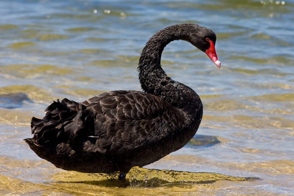

## Teine sammas - pensionikindlustus vs dividendid
_Avaldatud 22.02.2020_

### Sissejuhatuseks

Pensioni teise samba muudatuste tuulest inpireerituna tuli mul idee jagada alternatiivset viisi pensionikindlustusele kuidas 
enda teise samba väljamaksed võiksid korraldada kui pensioniiga kätte on jõudnud. Nagu ikka on antud kirjatükk minu hetkene nägemus
asjadest ja ei pretendeeri absoluutsele tõele, vaid pigem on mõeldud inpiratsiooniks ja on kirjutatud meelelahutuslikul
eesmärgil. Mul pole mingit erialast ega hariduslikku finantstausta ja seega tuleb järgnevat vaadelda läbi skeptilise 
prisma.

Nagu minu pseudonüümistki võib järeldada, mulle meeldivad dividendid. Eriti meeldivad mulle USA dividendid, kuna need makstakse
üldiselt korra kvartalis, mitte korra aastas, nagu paljud Euroopa ja Eesti firmad. USAst dividendide saamisel on oma 
plussid ja miinused. Ühest küljest on hea saada stabiilseid väljamakseid oma firmadest, see aitab motiveerida pikaajaliselt 
oma positsiooni hoidma ja teeb meele rõõmsaks kui dividendid kontole saabuvad, nagu palgapäeval. Teisest küljest on dividendide
maksmine kallim kui firmasiseselt reinvesteeritud raha, kuna esiteks ei hakka raha tööd tegema selles firmas, vaid makstakse 
omanikele ja teiseks sealt läheb teatud dividendide tulumaks maha enne kui see raha kontole jõuab. (Eesti pankadest investeerides, 
näiteks LHVst, läheb 15% maha dividendidest). Kolmandaks on USAst tulnud dividendid üldiselt dollarites, mis tähendab, et
kui need endale välja tahaksin maksta, tuleb maksta kellelegi valuutavahetustasu.    

### Millal dividende makstakse 

USA firmad maksavad üldiselt dividende kord kvartalis ja dividendide väljamakse kuupäev ja summa suurus on üldjuhul teada
mitu kuud enne väljamakse tegemist. Dividendi jõudmine maksmise hetkest panga, näiteks LHV kontole, võtab aega kuni paar nädalat.
See ei ole probleem, kuna stabiilsete väljamaksete tegemisel tähendab see lihtsalt, et sissetulev raha kontole on kuupäevaliselt nihkes. 
Pole ju otsest vahet, kas palgapäev on kümnendal või esimesel kuupäeval.

Üks kvartal jaguneb kolmeks kuuks [(loe siit)](https://www.investopedia.com/terms/q/quarter.asp) ja enamik USA firmadest 
maksab dividende kolmandas kvartali kuus, aga paljud maksavad ka teises ja esimeses kvartalikuus.

Eelnevat arvesse võttes on võimalik õigeid aktsiaid valides luua omale igakuine stabiilne sissetulek. Peab lihtsalt
otsima üles head stabiilsed firmad, mille väljamaksed toimuvad kvartali erinevates kuudes. Selline portfell on võimalik
luua, näiteks, ostes järgnevaid aktsiaid:

* Chubb ($CB) **Q1**
* Procter and Gamble ($PG) **Q2**   
* Intel ($INTC) **Q3**

### Dividendikuningad

Üks dividendide omadus on see, et väljamakstav summa muutub ajas. Headel aegadel üldiselt dividende tõstetakse ning
halbadel aegadel vähendatakse, kuid see pole reegel. Firmad võivad minna kriisidest läbi nii, et aktsia hind väheneb
tunduvalt, kuid dividendid suurenevad või jäävad samaks. Dividendide täpne suurus on firmasisene otsus ja ei sõltu
otseselt aktsiahinnast, ega teenitud tulust, kuid reegel on see, et firma, mis teenib pikka aega kahjumit muutub 
lõpuks maksevõimetuks.

Dividendide pikaajaline ajalugu on üks firma tervise indikaatoritest. Kui see on stabiilne või dividendid on ajas tõusnud
siis on aktsia investoritele atraktiivsem kui väga volatiilse dividendiajalooga firmadel. Samuti on väga kõrge
dividendimäär pigem ohumärk investoritele, kuna võib viidata firmasisestele probleemidele, näiteks ei ole firmal 
rahaga võimalik kasvu investeerida, mis näitab seda, et ka aktsiahinnal ei ole ruumi tõusta. normaalne dividendimäär 
on kuskil **1%** ja **4%** vahel. See protsent on tegelikult suht halb näitaja kuna seda arvutatakse aktsia hinna abil, 
mis muutub pidevalt. See kujutab siis täpsemalt ühe **aasta** kohta makstud dividendi hetkelisest aktsiahinnast. 
Reaalsuses kuulutavad firmad välja siiski konkreetse numbri, näiteks "järgmine kvartal makstakse 0.4$ dividendi aktsia 
kohta". Nii mõnigi firma ei maksa üldse dividendi - see pole ohumärk iseenesest, see lihtsalt võib tähendada, et 
firma suunab kasumi hoopis enda enda laienemisse, et tulevikus veelgi parem olla. Üldjuhul on siiski aktsia 
eesmärk lõpuks oma omanikele raha maksta dividendide näol, aga niikaua kuni seda ei tehta spekuleeritakse aktsia 
hinnaga ja loodetakse see kallimalt maha müüa järgmisele.    

USAs on tavaks saanud see, et dividende tõstetakse perioodiliselt. See meeldib investoritele ja üldiselt katab see ka
ära inflatsiooni puretud osa ja palju pealegi. Teatud USA firmadel on dividendikuninga tiitel, mis tähendab, et
see firma on tõstnud oma dividende tervelt 50 aastat järjest! Iga aasta. See tähendab ka seda, et siis kui peaaegu
finantsiline maailmalõpp oli saabumas 2008. aastal ja aktsiate hinnad vabalanguses olid või kui lennukid World Trade 
Centerisse lendasid, tõstsid need firmad oma dividende nagu midagi poleks juhtunud. Sellised *once in a lifetime*
katastroofid läbi elanud firmad on ennast tõestanud ja pole ilmselt kindlamat investeeringut samas tootlusklassis.

Sellised dividendikuningad on näiteks:

* Johnson &Johnson  (JNJ)
* Coca-Cola   (KO)
* Colgate-Palmolive  ($CL)

eelmise, 2019. aasta nimekirja kuningatest võib näha [siit](http://dividendvaluebuilder.com/dividend-kings-list/) . 
(See link ilmselt aegub millalgi tulevikus ja näitab mõnda muud aastat.)

Lisaks dividendikuningatele võib otsida ka dividendiaristokraate, mis on suurendanud dividendi vähemalt 25. aastat. 
Lisatingimusena peab aristokraadiks saamiseks firma olema S&P500 nimekirjas.

Kui lähed mingi firma dividendiajalugu uurima ja märkad, et ohhoo, see firma on ju vähendanud ühel aastal oma dividendi,
kuidas ta üldse dividendikuningas olla saab, siis arvesta, et mingil hetkel võib olla firma teinud **stock spliti**,
mis lihtsalt tähendab, et juhul kui see toimub kaks ühele, siis su aktsiate arv kahekordistatakse, aga dividend ja 
aktsia hind väheneb poole võrra. Sinu jaoks see midagi sisuliselt ei muuda. Need on lihtsalt sellised nüansid, 
mis on mõnikord andmetesse juba sisse arvestatud, teine kord mitte.

### Pensioni II samba kindlustusest

Teine sammas ja selle reform on hetkel selline lahtine teema, mille üle endiselt vaieldakse, aga oletades, et süsteem 
jääb/saab selliseks, et ma võin seda mingil viisil koguda ja lõpuks pensioniea saabudes võin selle korraga välja võtta või 
sõlmida pensionikindlustusleping mõne firmaga, mis mulle stabiilset summat maksab elu lõpuni 
(pikemalt [siin](https://raha.geenius.ee/eksklusiiv/suur-ulevaade-kui-palju-sa-praegu-tapselt-teisest-sambast-pensioni-saaks/)), 
tekkis mul peas väike sähvatus. Võibolla on parem viis oma pensionit nautida kui see kindlustusseltsile anda ja tagasi 
tilgutada või lihtsalt otsast kulutama hakata kuni see otsa saab.   

Miks mitte jagada sama raha, mis muidu kindlustusseltsile läheks, hoopis ära pikaajaliste dividendide maksjate vahel?
Ütlen kohe ära, et tulemuseks on esialgu väiksem igakuine sissetulek kui kindlustusseltsilt saades, kuid vaatame detailid
ka üle.

Ütleme, et ma olen 1990. aastal sündinud mees ja just jõudnud pensioniikka, ning mu teine sammas on suutnud kuskil selle 
sajandi keskpaigaks suureneda näiteks **100000€**-ni. Lihtsuse mõttes oletame, et see **100000€** on väärt samapalju kui täna - 
inflatsiooni mõttes võiksin ju suuremaid numbreid kasutada, aga ei näe selles kontekstis mõtet, lisaks on lihtsam nii 
tänaseid dividende, kalkulaatoreid ja aktsiahindu kasutada näiteks. 

Vaatame millist lisasissetulekut kindlustusseltsid mulle pakuks kui ma selle raha neile maksaksin ilma garantiiperioodita 
ja 2055 pensile läheksin 65 aastasena. (Eeldan, et ma elan vähemalt 80 aastaseks ja kavatsen rohkemgi elada. Hei, kui 
sa sellest vähem kavatsed elada, siis ilmselt on kõige mõistlikum raha välja võtta ja ära laristada.)

Sellest [kalkulaatorist](https://www.pensionikeskus.ee/eesti-pensionisusteem/kalkulaatorid/kindlustusseltside-kalkulaator/) 
saan parimaks pakkumiseks **463.70€** Kuus. Pensionilepinguid on võimalik sõlmida inflatsioonikaitsega ja ilma selleta. 
Kuigi ühe pakkuja lepingutingimusi läbi lugedes ja otsides sealt sõna inflatsioon, ma seda ei leidnud. Võib arvata, et nad seda hea 
meelega ei paku, või siis pakuvad tingimustel, mis vähendavad esialgsete väljamaksete suurust, st mingi hinna eest. 
Kindlustusfondid *võivad* maksta intressi lepingute teisele poolele kui nende investeeringud häid tulemusi teevad. See
tundub jällegi lahtine ja heale usule toetuv tingimus, ma ei oska sellega järgnevalt kuidagi arvestada, seega jätan välja. 

Niisiis, ma oletan, et see makse on stabiilne - ei vähene, ega suurene ajas, mis tähendab, et inflatsioon sööb selle 
mõju iga aastaga väiksemaks. See tähendab, et kui esimene aasta saan ma väärtust mahus **463.70€**, siis juba järgmine 
aasta, kui inflatsioon **~2%** on elu kallimaks muutnud, on see sama makse minujaoks ainult väärt **454.426**, sellest 
järgmine aasta **445.3€** jne. Pole tähtis, kas reaalselt on see **2%** või **1%** sellel hetkel, iga aasta muudab mind 
vaesemaks. Milline inimene tahab elada, kui teab, et järgmine aasta saab endale vähem lubada kui eelmine aasta ja 
tulevik on aina tumedam. Okei, päris nii hull asi vist ei ole, sellele lisaks on ju veel esimese samba pension, mille 
tõus küll ei ole kindel, aga ilmselt siiski toimub vaikselt, aga raske on ennustada millises mahus, kuna oma sisult 
on ta riigi toetatud püramiidskeem, mis sõltub paljustki vist selle hetke rahva maksudest ja nende pensioni 
sissemaksetest, kus pensionisaaja elab. Ainuüksi esimesele sambale ma, ausaltöeldes, ei julge lootma jääda. Pluss
pool selle kindlustuslepingu juures on ka olemas, et sissetulek on ikkagi kindel ja inimesel, kes talub vähem riski
võib see olla hea valik.

Võtame nüüd alternatiivse situatsiooni. Oletame, et ma olen pisut riskialtim ja võtan oma raha välja, maksan sealt
**20%** tulumaksu ja mulle endale jääb kätte **80000€**. Selle raha ma paigutan investeerimiskontole ja vahetan mingi tasu
eest dollariteks. Oletame, et see tasu oli selline **1%** ja mulle jääb kätte 79200€ väärtuses dollareid 
($85908 praeguse kursi järgi). Selle dollarite eest ma ostan näiteks Coca-Cola aktsiaid (reaalsuses võiks ikkagi 
hajutada erinevate dividendiaktsiate vahel, et erinevad kvartali kuud oleks dividendidega kaetud ja et ühe firma langus 
ei muutuks sinu enda enda languseks). Coca-Colal on viimasel ajal probleeme olnud, kuna inimesed on muutnud oma 
käitumisharjumusi tervislikumaks, aga ärme seda selletõttu kohe maha kanna ja näites võib ikka kasutada. Niisiis saan 
ma tänase hinna järgi **$85908 / $60.13 = 1428** aktsiat. Jätame selle teenustasu siinkohal arvestamata, kuna ka aktsia 
hind võib kõikuda ja ühel päeval odavamalt saada kui teisel, niisiis on täiesti realistlik saada praegusel perioodil 
**1428** aktsiat selle raha eest. Coca-Cola maksab hetkel dividendiks **$0.40** aktsia kohta kvartalis, mis teeb ta dividend yieldiks
2.73%, mis on täitsa realistlik ja normaalne. See teeb **$0.13** kuus, mis teeb omakorda eurodes **~0.12€** kuus. 
Mis annab minu aktsiate kohta **171.36€** kuus sissetulekuks, kust läheb
veel maha **15%** usa dividendidelt saadud maksu, see tähendab, et investeerimiskontole jõuab ainult **~145.65€** kuus.
Mmm. väheks jääb, võrreldes kindlustuse pakutud **445.3** euroga on see vaid üks kolmandik sellest. Sellele **145€** rakendub
veel ka tulumaks, aga investeerimiskonto süsteemi kasutades ei tule tulumaksu enne maksta, kui kontolt väljavõetud summa
hakkab ületama kontole sisse makstud summat, st mu esimesed **80000€** siiski ma midagi juurde ei pea maksma ja võin vabalt 
dividendidest sisse tulnud raha omale välja maksta kartamata, et maksuamet kraesse lendab.

Okei **~145€** on vähe, aga ilmselt pole see su ainuke sissetulek, sul on veel esimene sammas ja tõenäoliselt on sul veel
sääste ja rasva, mitte ainult tühjad pihud pensioniikka jõudes. Võibolla isegi on lapsed, kellelt saab alguses mõned 
kümned eurod juurde nõuda kui tõesti hakkama ei saa (sellest pärast pikemalt). Näe 100000€ oli võibolla madal valik 
selleks näiteks, aga vast on reaalne summa, mille mõni indeksifondis sammast hoidnud keskmise palgaga tegelane 
võib kokku ajada selle ajaga. 
 
Esimese aasta saan ma **145€**, järgmine aasta tõstetakse dividendi tagasihoidlikult kuskil **%5** ja igakuine sissetulek on juba
umbes **152.25€**. See on täiesti reaalne, vaata näiteks $C, $CL, $JNJ dividendide ajalugu. Paljudel juhtudel tundub, et isegi 
tõstetakse 10% kaupa, aga ma nii julget ennustust ei taha teha pikema perioodi peale. Colgate-Palmolive, näiteks, on viimase 
kümne aastaga enda dividendid kahekordistanud. Kui vaadelda aastaid 2007-2017, millesse ka kriis jäi, sai **$0.16** 
väljamaksest kümne aastaga **$0.39**, nagu poleks olnudki kriisi. **~145.65€** suurusest sissetulekust oleks puhtalt 
Colgate abiga saanud viimase kümne aastaga **~291.3€** sissetulek. Pole paha ju tegelikult. Jah, kümne aastaga saab 65-aastasest 
ka juba 75-aastane, aga eeldame, et inimesel on siiski ka muu sissetulek peale teise samba ja ta elab ära ka ilma selleta 
kuidagi. McDonalds (mis veel pole dividendikuningas, aga saab **2022.** aastal) on tõstnud oma dividendi **0.55$** 
pealt **$1.25**, samuti rohkem kui **2x** kasv kümne aastaga.

Okei, aga miks teenida vähem kui ma saaks kohe kindlustusfirma käest rohkem? No alustada võib juba ka sellest, et vaid
teise kümnendi **~291.3€** saab (õige investeeringu puhul) järgmise kümne aastaga tunduvalt suurem summa kui 
kindlustusfirma **463.70€**. Kirsiks tordil on veel see, et su esialgne rahaline investeering aktsiatesse on 
veel alles, vaatamata sellele, et sa selleks hetkeks juba 20 aastat oled pensionit saanud. Ja kui sa veel pärast esimest
kümmet aastat aktsiahinda vaatad, siis mõnda vanakooli [blue chip](https://www.investopedia.com/terms/b/bluechip.asp) 
aktsiasse pandud raha on suure tõenäosusega ka mitmekordistunud. Ehk siis su kontolt vaatab **79200€** asemel vastu 
ilmselt **158400€** või hoopis näiteks **237600€** (McDonaldsi aktsia on viimase kümne aastaga tõusnud lausa **240%**).

Kui ma nüüd üks hetk sussid püsti viskan, siis sul on üks meeletu pärandus anda oma järglastele. Sadades tuhandetes
eurodes aktsiaid ja sisuliselt väike passiivne sissetulek (millest ka eespool olev soovitus lastelt raha nõuda
alguses kui muidu hakkama ei saa). Kui võrrelda seda, mis kindlustusselts mu järglastele jätaks (mitte midagi, 
see raha kuulub nüüd neile ja leping loetakse surmaga lõpetatuks), siis on vist päris hea diil. :)

### Riskid / Must luik ja Lindy efekt

Ilus jutt küll, aga kui see kõik nii lihtne on, siis miks kõik raha nendesse aktsiatesse ei pane ja rikkaks ei saa?
Eks ta ole nii jah, esiteks, see on puhtalt minevikuandmete järgi spekuleerimine. Ainuke garantii on see, et dividendid
on stabiilsemad kui üldine aktsiaturg, nende maksmist ei otsusta aktsiate nõudlus ja pakkumine, hirm ja ahnus, ajutised
turumeeleolud, vaid stabiilsed inimesed firma sees ja tahtmine omada seda dividendikuninga tiitlit. Üldiselt võib vist öelda, 
et nende dividendiaktsiate hind liigub pikas perspektiivis dividendi maksmise järgi. Kui mõni firma on võtnud omale eesmärgiks
läbi aastakümnete dividendi kasvatada, siis võib arvata, et turg reguleerib ennast vastavalt ja aktsia hind liigub selle järgi.

Lindy efekt räägib sellest, et ideed, protsessid ja meetodid, mis ajas on püsinud ja mis ajaga ei kulu, nende eeldatav eluiga
suureneb iga aastaga. Sellest ka võib arvata, et pikaajalised dividendimaksjad pigem jätkavad maksmist ja oma 
dividendide suurendamist. 

Riskidest ei tohiks veel eirata valuutariski, sest tegemist on ikkagi võõra maa rahaga, ja samuti geopoliitilisi riske, 
sest USAle väga meeldib sõda pidada ja maailmapolitseid mängida, olles paljudele sihtmärk.   

Jõudeski [musta luige teooriani](https://en.wikipedia.org/wiki/Black_swan_theory). Tuleb arvestada sellega, et vahetevahel toimuvad
maailmas enneolematud sündmused, mida ükski mudel ja ennustus ette ei näe ja mis kõik pahupidi pööravad. Nassim Taleb-ile
meeldib väga kõiki analüütikuid lollideks nimetada, sest kõik nende mudelid eiravad täielikult mustade luikede olemasolu 
(lugemisvara: `The Black Swan: The Impact of the Highly Improbable`). Sina pead lihtsalt lootma, et see järgmine 
*black swan* on sinu kasuks, mitte vastu. Võib juhtuda, et kaob ära pension, aktsiaturg või Ameerika, või lõpetavad 
dividendikuningad ühel hetkel maksmise, miski pole võimatu.

PS: Kui on tahtmine kommenteerida, siis saab seda teha Github'i konto abil [siin](https://github.com/dividendiinsener/blog/issues/3)
